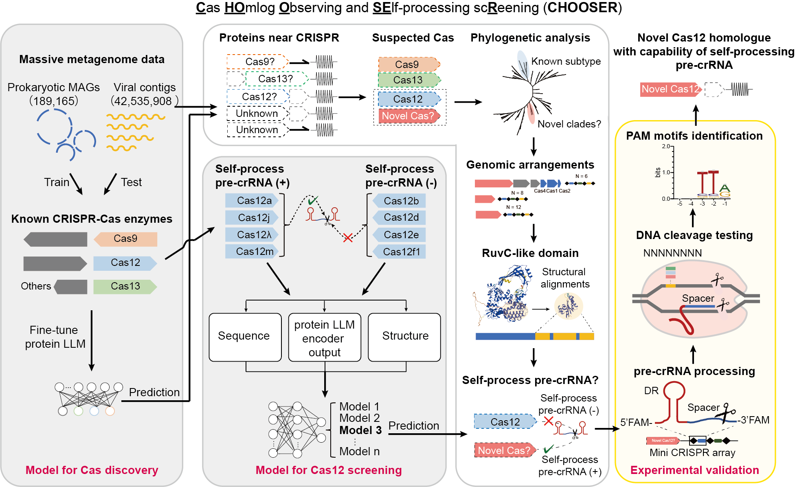

# CHOOSER
A comprehensive computational framework, CHOOSER (**C**as **HO**mlog **O**bserving and **SE**lf-processing sc**R**eening) for CRISPR-Cas homologues discovery and self-processing-pre-crRNA functional screening by foundation models.

## Colab Notebook

01_CasDiscovery [colab_notebook](https://colab.research.google.com/drive/1oxa1YrmgCe5ok7GwWCuHwGoZ1M_Otikr?usp=sharing)

02_Cas12_SelfProcessing [colab_notebook](https://colab.research.google.com/drive/1D5_Qffq-EUZYQk_tTKMftCv9wvxSh2Kz?usp=sharing)

## Model weights & example data

*Note: before running the notebooks, please ensure that you have to save/add the following folders into your Google Drive ("MyDrive" folder):

- [model](https://drive.google.com/drive/folders/1y4WKwsoBsqBb_R2Cdj0cwYiLIPnBXj01?usp=sharing)

- [inputs](https://drive.google.com/drive/folders/18GGlIEWYtJVTn2oBXMqbghyYQCLKelLg?usp=sharing)

## Contacts

qiliu@tongji.edu.cn, liwh@zhejianglab.com, liwh@tongji.edu.cn