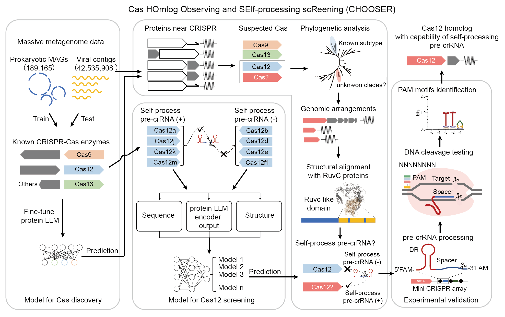

# CHOOSER: Discovering CRISPR-Cas system with self-processing pre-crRNA capability by foundation models

## Introduction

This repository hosts the custom code of **CHOOSER** (**C**as **HO**mlog **O**bserving and **SE**lf-processing sc**R**eening), a novel, effective and unified AI framework for alignment-free discovery of novel CRISPR-Cas systems with self-processing precursor CRISPR RNA (pre-crRNA) capability utilizing protein foundation models. 

## Model weights & example data

*Note: before running the notebooks on Colab, please ensure that you have to save/add the following folders into your Google Drive ("MyDrive" folder):

- [model](https://drive.google.com/drive/folders/1y4WKwsoBsqBb_R2Cdj0cwYiLIPnBXj01?usp=sharing)

- [inputs](https://drive.google.com/drive/folders/18GGlIEWYtJVTn2oBXMqbghyYQCLKelLg?usp=sharing)

- [data](https://drive.google.com/drive/folders/1WcClm_TebUuuRY_b8i6n6EuEXdR_WhT2?usp=sharing)

- [ccminer](https://drive.google.com/drive/folders/1uPjufxWPjEmx2yDota60qVl05dugS0OS?usp=sharing)

## Environment

CHOOSER is run on Python 3.9 and PyTorch 1.13.1. You can build a conda environment for CHOOSER using this [script](https://github.com/zjlab-BioGene/CHOOSER/blob/main/env/env_install.sh).

## Run CasDiscovery
The model weights of CHOOSER and a minimum dataset to run CHOOSER are available in [Zenodo](https://zenodo.org/records/13906238) (DOI: 10.5281/zenodo.13906238). A small example dataset are also provided:

[models_weights.zip](https://zenodo.org/records/13906238/files/models_weights.zip?download=1)

[example_data.zip](https://zenodo.org/records/13906238/files/example_data.zip?download=1)

<pre>
#conda activate chooser
python CasDiscovery -m models_weights/CasDiscovery -i example_data/suspicious.faa -o suspicious_pred.csv
</pre>

## Custom code for Colab Notebook

### Step.1 Get suspected proteins near CRISPR arrays

Install and run our bioinformatic pipeline [CRISPRCasMiner](https://github.com/zjlab-BioGene/CRISPRCasMiner) to fetch the suspected proteins around the CRISPR arrays. Custom code is provided here: [01_Get_Suspected_Proteins_near_CRISPR.ipynb](https://github.com/zjlab-BioGene/CHOOSER/blob/main/01_Get_Suspected_Proteins_near_CRISPR.ipynb), or you can run on Colab notebook: [colab_notebook](https://colab.research.google.com/drive/1PYo_vFefUnPWgFLQ5q3Oxu2pTtx9BvzY?usp=sharing):

`Input`: Metagenome-assembled genomes/contigs.

`Output`: Known CRISPR-Cas systems & suspicious proteins adjacent to CRISPR arrays.

### Step.2 Cas homolog discovery

Run CHOOSER to discern Cas homologs: [02_CasDiscovery.colab.ipynb](https://github.com/zjlab-BioGene/CHOOSER/blob/main/02_CasDiscovery.colab.ipynb), or you can run on Colab notebook: [colab_notebook](https://colab.research.google.com/drive/1oxa1YrmgCe5ok7GwWCuHwGoZ1M_Otikr?usp=sharing)

`Input`: suspicious proteins in .fasta/.faa format.

`Output`: predicted tags of the proteins, including `cas9`, `cas12`, `cas13` and `other`.

### Step.3 Pre-crRNA self-processing functional screening of Cas12 homologs 

For the Cas12 candidates, we predicted whether they are able to self-process pre-crRNA or not: [03_Cas12_SelfProcessing.ipynb](https://github.com/zjlab-BioGene/CHOOSER/blob/main/03_Cas12_SelfProcessing.ipynb), or you can run on Colab notebook: [colab_notebook](https://colab.research.google.com/drive/1D5_Qffq-EUZYQk_tTKMftCv9wvxSh2Kz?usp=sharing)

`Input`: Cas12 proteins in .fasta/.faa format.

`Output`: predicted wether the Cas12 candidates would self-process their pre-crRNAs.

## Datasource

| Source | DataBase | DataSet | Download URL |
| - | - | - | - |
| Prokaryotic | MGnify | mgnify_human_gut mgnify_human_oral mgnify_cow_rumen mgnify_pig_gut mgnify_fish_gut mgnify_marine | https://www.ebi.ac.uk/metagenomics/browse/genomes |
| Prokaryotic | GEM | GEM | https://portal.nersc.gov/GEM |
| Prokaryotic | GMBC | GMBC-high GMBC-medium | https://gmgc.embl.de/download.cgi |
| Prokaryotic | BGI_human_oral | 4D-SZ cohort | https://db.cngb.org/search/project/CNP0000687 |
| Prokaryotic | glacier | Glacier Microbiomes | https://www.biosino.org/node/project/detail/OEP003083 |
| Viral | gutPhageDB | gutPhageDB | https://www.sanger.ac.uk/data/gut-phage-database |
| Viral | IMGVR | IMG/VR | https://genome.jgi.doe.gov/portal/IMG_VR/IMG_VR.download.html |
| Viral | MGV | Metagenomic Gut Virus | https://portal.nersc.gov/MGV |
| Viral | GVD | Gut Virome Database | https://bitbucket.org/MAVERICLab/gvd |
| Viral | HuVirDB | Human Virome Database | http://opengut.ucsf.edu/HuVirDB-1.0.fasta.gz |

## Citation

Li, Wenhui, Xianyue Jiang, Wuke Wang, Liya Hou, Runze Cai, Yongqian Li, Qiuxi Gu et al. "Discovering CRISPR-Cas system with self-processing pre-crRNA capability by foundation models." Nature Communications 15, no. 1 (2024): 10024.

DOI: https://doi.org/10.1038/s41467-024-54365-0

PMCID: PMC11576732

## Contacts

qiliu@tongji.edu.cn, liwh@zhejianglab.org, liwh@tongji.edu.cn
